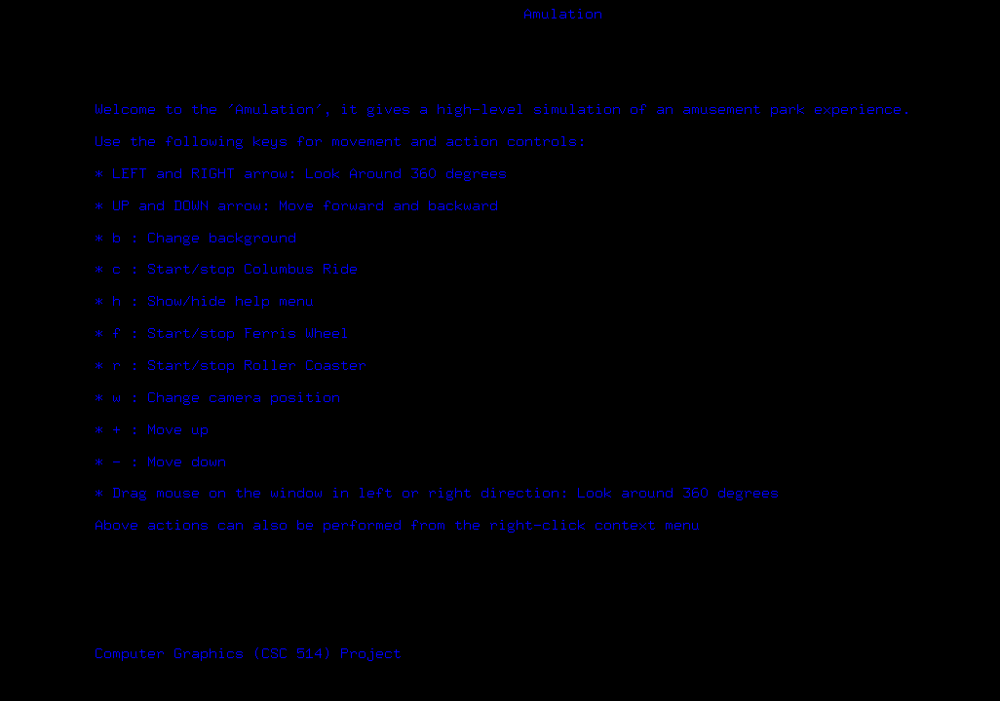

# Amulation
Graphical Implementation of the Simulation of an Amusement Park. 

The aim of this project is simply to provide a simulation experience of an amusement park. 

The scope of the project is limited to 3 rides, which are the:
1. Ferris Wheel 
2. Columbus Ride 
3. Roller Coaster

These 3 rides are modelled and drawn as 3D objects using OpenGL primitives, like cubes,
spheres and cylinders. The Ferris Wheel as shown in figure 2 is drawn as a circular ring in
conjunction with “trolleys” which acts as seats. The ring usually moves in a rotatory fashion,
which can be controlled using the keyboard as well as selecting the action in the window menu
as shown in figure 1 and 2.1 respectively. The colours of the ferris wheel can also be changed in
the same window menu.

Figure 1

3

Figure 2

Figure 2.1

4

The Columbus ride takes the shape of a ship as shown in figure 3. This ride usually moves by
performing a swinging action, this can also be controlled using the keyboard and selecting the
option from the window menu as shown in figure 3.1. The colours can also be changed by
selecting the specific colours from the drop-down menu.

Figure 3

5

Figure 3.1
The Roller Coaster, similar to the traditional rollercoaster, moves in a specified track as shown in
figure 4. These tracks are created using Bezier curve functions as shown in figure 4.1 with a set
of defined control points. The roller coaster can be controlled using the keyboard and selecting

6

the action from the window menu as shown in figure 4.2, the colours of the trolley that moves
along the track can also be changed like the other two rides.

Figure 4

7

Figure 4.1

Figure 4.1
The first-person camera position can also change with respect to the three rides as shown in
figure 5. The scene can be constructed by placing the objects into the appropriate locations
within the scene reference frame. This is achieved by placing the whole scene inside a texture

8

mapped cube called “SkyBox”. This gives a realistic sky effect, even though the entire scene is
not spherical in reality, it gives off an illusion of a sphere-like continuum.

Figure 5

9

This project can simply be executed by running the “Amulation.sln” file and debugging using the
visual studio IDE.
